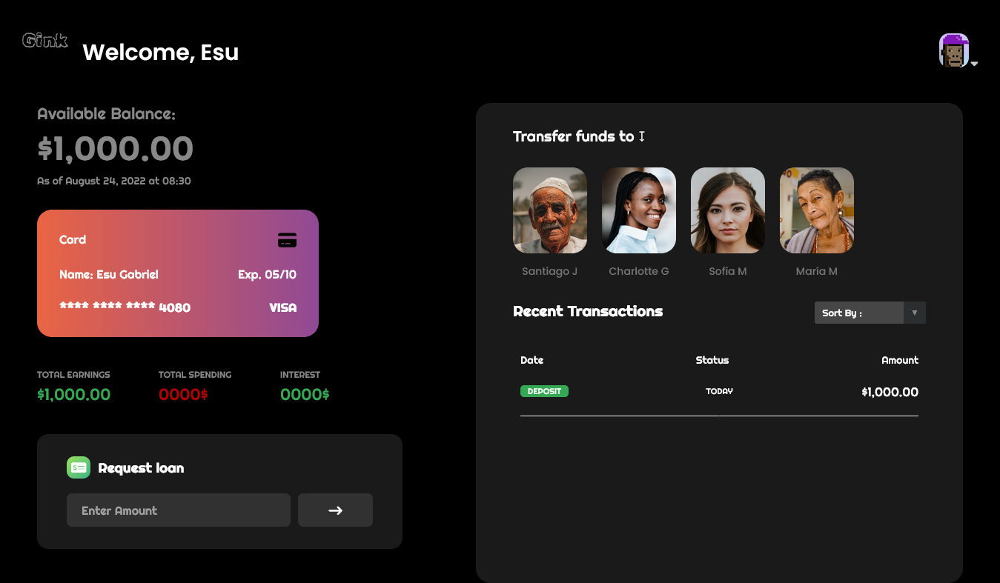

# **Gink** 🏦:
Gink is a mini banking application built with JavaScript.

# **Project Description**:

Gink is a mini banking application, that enables transfer of funds between users (new and existing), loans request and account closure. 

Live Site URL: [Gink](https://gink.netlify.app)

**All Users Can**:

- View Balance 💶
- View Total Earning 📩, 
- View Total Spending 📤 
- View Interest 💹
- View Transaction History 📜
- Request Loan 💵
- Transfer funds to existing users 💸
- Close Account
- Log out 📤

**New Users can**: 
- Create Account 📂

**Existing Users can**: 
- Login

> If a new user transfers funds into an existing user account, the new user can log out of their account and log into exisiting users account to confirm if the funds were recieved via:
>
> ### **Santiago Jimenez**  
>
>   
>
> - **Username**: Sj
> - **Pin**: 1111
>
> ---
>
> ### **Charlotte Gin**  
>
>   
>
> - **Username**: cg
> - **Pin**: 2222
>
> ---
>
> ### **Sofía Mercedes**  
>
>   
>
> - **Username**: sf
> - **Pin**: 3333
>
> ---
>
> ### **María Mateo**  
>
>   
>
> - **Username**: mm
> - **Pin**: 4444  

## **Technologies Used** :
- HTML
- CSS
- JavaScript
- [GSAP](https://greensock.com/gsap/) - JavaScript Animation Library

## **Credit**: 
Images Sourced from [Unsplash](https://unsplash.com)